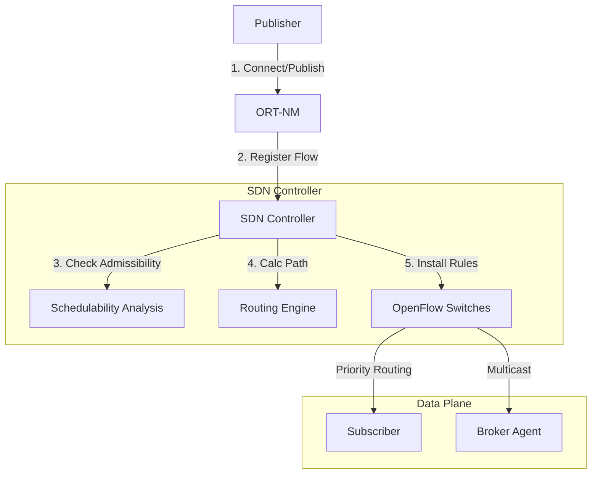

# MRT-MQTT System Architecture

## Overview
The architecture is designed to decouple the **Control Plane** (SDN Controller) from the **Data Plane** (Switches/Brokers) to ensure real-time guarantees for MQTT traffic.

## Components

### 1. Control Plane (SDN Controller)
*   **Admissibility Control**: Uses `schedulability/analysis.py`. Before admitting a flow, it calculates if the Worst-Case Response Time (WCRT) exceeds the Deadline ($D_i$).
    *   **HA (Holistic)**: Pessimistic, accounts for all interference.
    *   **TA (Trajectory)**: Optimistic, accounts for pipelining.
*   **Routing Engine**:
    *   Maintains a generic graph of the network using `NetworkX`.
    *   Updates Edge Weights dynamically based on `Monitor` stats ($delay / (1-util)$).
    *   Uses **Steiner Tree** for QoS 0/1/2 Multicast distribution.

### 2. Management Plane (ORT-NM)
*   **Optimized Real-Time Network Manager**: Acts as a proxy/interceptor.
*   Extracts `User Properties` (MQTT v5) containing Real-Time attributes (Period, Deadline, Cost).
*   Forwards these to the Controller via REST API.

### 3. Data Plane (Switches & Brokers)
*   **OpenFlow Switches**:
    *   **Meters**: Police traffic to ensure flows don't exceed reserved Bandwidth ($BW_i$).
    *   **Queues**: $P_i$ maps to Hardware Priority Queues (0-7).
    *   **Groups**: Type ALL groups used for Multicast replication.
*   **Broker Agent**:
    *   Sidecar to the broker.
    *   Joins UDP Multicast groups.
    *   Injects traffic back into the Application Layer (Mosquitto).

## Key Workflows

### Flow Registration
1.  **Publisher** sends MQTT CONNECT + PUBLISH with RT properties.
2.  **ORT-NM** intercepts, parses properties.
3.  **ORT-NM** POSTs to `/mrt/register_flow`.
4.  **Controller** builds `RTAttributes`.
5.  **Controller** runs `AdmissionControl.check()`.
6.  If Accepted:
    *   **Routing** calculates path `[Link1, Link2...]`.
    *   **Controller** installs Meters and Flow Entries on all switches.
    *   **ORT-NM** allows PUBLISH to proceed.

### Dynamic Subscriber Join
1.  **Subscriber** sends MQTT SUBSCRIBE.
2.  **ORT-NM** detects new subscription.
3.  **ORT-NM** POSTs to `/mrt/register_subscriber`.
4.  **Controller**:
    *   Identifies Flow Topic.
    *   If QoS 0 (Direct): Recalculates Multicast Tree (Grafting).
    *   If QoS 1/2 (Broker): Selects optimal RP, routes generic multicast to Broker.
    *   Updates OpenFlow Group Tables on switches.
