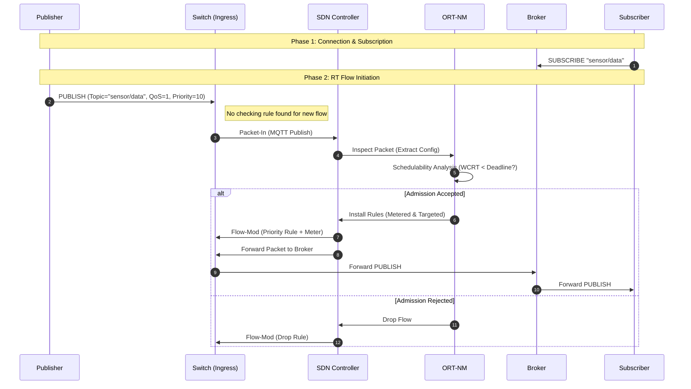

# MRT-MQTT System Flow

This document visualizes the control and data flow within the MRT-MQTT framework as demonstrated in the experiment.

## 1. Network Topology

The experimental setup consists of a Publisher, a Broker, a Subscriber, and 3 OpenFlow switches managed by a Ryu SDN Controller.

```mermaid
graph TD
    subgraph SDN_Control_Plane
        C[Ryu SDN Controller]
        NM[ORT-NM (Network Manager)]
    end

    subgraph Data_Plane
        Pub[Publisher (h1)]
        Sub[Subscriber (h3)]
        Broker[Broker (h2)]
        
        S1{Switch S1}
        S2{Switch S2}
        S3{Switch S3}
    end

    %% Connections
    Pub -->|RT Flow| S1
    S1 --- S2
    S2 --- S3
    S3 --- Broker
    S3 --- Sub
    
    %% Control Connections
    S1 -.->|OpenFlow| C
    S2 -.->|OpenFlow| C
    S3 -.->|OpenFlow| C
    
    %% Manager Interactions
    C <-->|REST API| NM
```

## 2. Message Interception & Flow Management

The following sequence diagram illustrates the process when a Publisher sends a Real-Time (RT) MQTT message.



## 3. Flow Specification (Experiment)

The specific flow verified in the `experiment_runner.py` configuration:

| Attribute | Value | Description |
| :--- | :--- | :--- |
| **Topic** | `sensor/data` | Flow Identifier |
| **QoS** | 1 | At least once delivery |
| **Priority** | 10 | Real-time priority level |
| **Period (T)** | 1000 ms | Message generation interval |
| **Deadline (D)** | 500 ms | Relative deadline for end-to-end delivery |
| **Transmission Time (C)** | 20 ms | Max transmission time on link |
| **Min Bandwidth** | 1 Mbps | Reserved bandwidth |

## 4. Logical Sequential Flow

The following details the sequential logic execution from the code perspective:

### Phase 1: Initialization & Subscription
1.  **Topology Startup**: Mininet starts the network; Ryu Controller connects to switches.
2.  **Subscriber Join**: The Subscriber (`h3`) connects to the Broker (`h2`) and subscribes to `sensor/data`.
3.  **NM Sniffing**: The ORT-NM (Network Manager) sniffer detects the SUBSCRIBE packet and registers the Subscriber's location (Switch Port/IP) with the SDN Controller via REST API (`/mrt/register_subscriber`).

### Phase 2: Publisher Flow Initiation
4.  **Attribute Definition**: The Publisher (`client.py`) defines Real-Time Attributes (Priority, Deadline, etc.) in a dictionary.
5.  **Pre-Publish Check (Simulation)**: In the Python simulation, the Publisher script *first* calls ORT-NM directly (`ort_nm.handle_publish`) to request admission. NOTE: In a full deployment, this would happen via packet interception at the switch, but the simulation shortcut allows direct validtion.
    *   *Input*: Topic, RT Attributes, Source IP.
6.  **NM Hand-off**: ORT-NM forwards the request to the SDN Controller (`/mrt/register_flow`).

### Phase 3: Admission Control & Routing
7.  **Schedulability Analysis**: The Controller calls `AdmissionControl.check_admissibility`.
    *   It calculates the Worst-Case Response Time (WCRT) considering existing flows and network delays.
    *   **Logic**: `WCRT = C_i + Blocking + Interference + Jitter`.
    *   **Decision**: If `WCRT <= Deadline`, the flow is **ADMITTED**.
8.  **Routing**: If admitted, the Controller calculates the multicast tree (Source -> Broker -> Subscribers) to optimize path delivery.

### Phase 4: Policy Enforcement
9.  **Rule Installation**: The Controller installs OpenFlow rules on the switches:
    *   **Meters**: Policing bandwidth usage (e.g., 1Mbps limit).
    *   **Priority Queuing**: Assigning the flow to a high-priority queue (e.g., Queue 0).
    *   **Forwarding**: Directing packets along the computed path.
10. **Data Transmission**: The Publisher begins sending actual MQTT PUBLISH packets. These now match the installed high-priority rules and traverse the network with guaranteed QoS.
